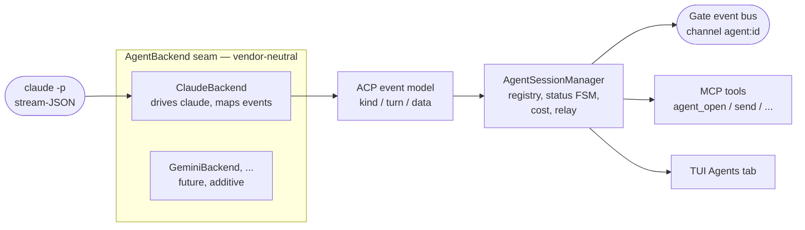

# AI Agent Sessions

Kaimon can spawn and own **AI agent sessions** -- a headless `claude` process that
you talk to programmatically. Kaimon launches the agent, normalizes its output into
a vendor-neutral event model, streams those events on the gate event bus, and tracks
each agent's lifecycle and token usage. The natural sibling of a gate REPL session
and a managed extension.

An agent session is "an AI you can drive": open one in a directory, send it turns,
and consume the streamed assistant text, reasoning, and tool calls as it works.
You drive it with a small set of MCP tools and consume one event channel per agent.

## How It Works



1. **`ClaudeBackend`** drives the local `claude` CLI in headless multi-turn
   stream-JSON mode (`claude -p --input-format stream-json --output-format stream-json`),
   reading events over a pipe.
2. The backend maps Claude's native stream-JSON events into the **ACP update model**
   -- Kaimon's vendor-neutral lingua franca (modeled on the
   [Agent Client Protocol](https://agentclientprotocol.com) update schema). A future
   `GeminiBackend` / `ACPClientBackend` slots in by implementing the same handful of
   methods; everything above the seam is written once.
3. The **`AgentSessionManager`** owns the process, runs the status FSM, accumulates
   per-session cost, and relays every event onto the gate event bus on channel
   `agent:<id>` as a `{kind, turn, data}` envelope.

!!! tip "Authentication"
    Agents authenticate with the **host's own `claude` login** (your subscription) --
    Kaimon never touches credentials. You must be logged in to the `claude` CLI. No API
    keys are required.

!!! warning "Cost"
    Agent usage draws against your Claude **Agent SDK monthly credit** -- it is *not*
    free. A per-session **dollar** figure is **work in progress**: claude's reported
    `total_cost_usd` is unreliable (especially on subscription plans), so `costUsd` is
    held at `0.0` for now rather than shown — token usage *is* tracked and surfaced in
    `agent_status`. The default model is the `sonnet` family alias, which resolves to
    the CLI's latest Sonnet (pass a pinned id like `claude-sonnet-5` for
    reproducibility). Images returned in tool results are the biggest credit burner
    (billed roughly `width × height / 750` tokens), so tool-result PNGs are
    box-downsampled to a max long edge before they reach the agent --
    `agent_image_max_long_edge` in `~/.config/kaimon/config.json` (default 1568 px, the
    model's own effective cap; lower it to trade image quality for credit).

## Opening an Agent

Open an agent with `agent_open`, giving it a working directory. It returns an
`agent_id`; events then stream on `agent:<id>`.

```jsonc
// agent_open
{ "cwd": "/path/to/project", "model": "sonnet", "permission": "default" }
// → {"agent_id": "9f3a1c20"}
```

Then send it turns and consume the `agent:9f3a1c20` channel:

```jsonc
// agent_send
{ "agent_id": "9f3a1c20", "text": "Summarize the failing tests in this repo." }
// → {"turn": 1}
```

## The MCP Tools

All are registered as Kaimon MCP tools, callable by your own Claude Code and by
extensions via the service endpoint. Returns are JSON strings.

| Tool | Arguments | Returns |
|---|---|---|
| `agent_open` | `cwd` (req), `model`, `effort`, `permission`, `permission_mode`, `allowed_tools`, `disallowed_tools`, `mcp_config`, `system_prompt`, `id` | `{"agent_id": "<id>"}` -- spawns & owns the process |
| `agent_send` | `agent_id` (req), `text` (req) | `{"turn": <n>}` -- writes a user turn (async); events stream on `agent:<id>` |
| `agent_run` | `agent_id` (req), `text` (req), `timeout` | `{"text": "…"}` -- sends a turn and **blocks** until it ends, returning the assistant text |
| `agent_output` | `agent_id` (req), `turn`, `which` ("last_message"/"full_turn"/"all"), `include_tools`, `max_chars` | `{agent_id, turn, status, done, text, truncated, dropped_chars, usage}` -- **non-blocking** read of an agent's output (partial while still working). Pair with `agent_send` to dispatch-then-poll instead of blocking on `agent_run` |
| `agent_status` | `agent_id` (req) | `{status, model, cwd, turn, created_at, last_activity, session_id, transcript, event_log, usage}` |
| `agent_list` | -- | `{"agents": [ …status… ]}` |
| `agent_interrupt` | `agent_id` (req) | `{"interrupted": bool}` -- best-effort cancel of the in-flight turn |
| `agent_close` | `agent_id` (req) | `{"closed": bool}` -- kills the process; the slot is retained as `:dead` for review |

### `agent_open` options

| Option | Default | Description |
|---|---|---|
| `cwd` | *(required)* | Working directory for the agent. Must exist. |
| `model` | `sonnet` | Model alias or id. The `sonnet` alias tracks the latest Sonnet; pin (e.g. `claude-sonnet-5`) for reproducibility. A Claude model may carry an inline effort suffix, e.g. `claude-sonnet-5/high` or `sonnet/low`. |
| `effort` | *(CLI default)* | Claude thinking/effort level (`low \| medium \| high`) → `claude --effort`. Lower = less thinking, faster turns. Overrides a `model` suffix if both are given. |
| `permission` | `default` | Permission **preset** (see below): `default \| lab \| auto \| bypass`. |
| `permission_mode` | *(from preset)* | Override the preset's raw claude permission-mode: `default \| acceptEdits \| plan \| auto \| bypassPermissions`. |
| `allowed_tools` | `[]` | Extra tool allowlist. Composes with the preset. |
| `disallowed_tools` | the `agent_*` tools | Tools the agent may **not** call. Defaults to a recursion guard (see below). Pass `[]` to allow nested agents. |
| `mcp_config` | `null` | Path to an `--mcp-config` JSON pointing the agent at the live Kaimon MCP, so it can call `slate.*` / `ex` / extension tools. |
| `system_prompt` | `null` | Instructions/context appended to the agent's system prompt (applies to every turn). |
| `id` | *(auto)* | Caller-supplied agent id (e.g. key it to a notebook). Reopening a `:dead` id reuses the slot. |

### Permission presets

Rather than assembling raw flags, pick one word per spawn. The recursion guard stays
on regardless.

| Preset | Posture | Effect |
|---|---|---|
| `default` | Edits only | `acceptEdits` permission mode; no extra tools. |
| `lab` | Drive the lab | Allows the whole Kaimon MCP server (`mcp__kaimon`) so the agent can drive `slate.*` / `ex` / etc. |
| `auto` | Self-governing | The model's permission classifier decides per call. |
| `bypass` | No checks | Adds `--dangerously-skip-permissions`. **Sandboxed / trusted directories only.** |

An explicit `permission_mode` overrides the preset's mode; `allowed_tools` composes
with the preset's allowlist.

!!! warning "Recursion guard"
    By default an owned agent is blocked from calling the `agent_*` tools
    (`--disallowedTools`), so it cannot recursively spawn or kill agents (a fork bomb).
    Pass `disallowed_tools = []` to deliberately allow nested agents.

## The Event Stream

Every agent event is published on **Kaimon's global event bus** -- the same one
extensions already subscribe to (`ipc://<sock_dir>/kaimon-events.sock`, topic = channel
name). The channel is `agent:<agent_id>`, and each message is a `{kind, turn, data}`
envelope, JSON-encoded.

```jsonc
// streamed assistant text — delta:true is an incremental token chunk to append;
// delta:false (also emitted at block end) is the complete, authoritative copy
{"kind":"assistant_text","turn":1,"data":{"delta":true,"content":{"type":"text","text":"two-"}}}
{"kind":"assistant_text","turn":1,"data":{"delta":false,"content":{"type":"text","text":"two-state paramagnet…"}}}
// reasoning (same delta semantics)
{"kind":"thought","turn":1,"data":{"delta":true,"content":{"type":"text","text":"…"}}}
// a tool the agent invoked (status in_progress)
{"kind":"tool_use","turn":1,"data":{"call":{"toolCallId":"tu1","title":"Read",
  "kind":"read","status":"in_progress","content":[],"locations":[],"rawInput":{…}}}}
// a tool result (status completed|failed) — content blocks incl. base64 images
{"kind":"tool_result","turn":1,"data":{"update":{"toolCallId":"tu1","status":"completed",
  "content":[{"type":"content","content":{"type":"text","text":"ok"}}]}}}
// end of turn — stop reason + usage (costUsd is WIP, held at 0.0)
{"kind":"result","turn":1,"data":{"stopReason":"end_turn",
  "usage":{"inputTokens":100,"outputTokens":50,"cacheReadTokens":10,"cacheCreationTokens":0,"costUsd":0.0}}}
// lifecycle / misc
{"kind":"status","turn":1,"data":{"status":"working"}}   // starting|idle|working|dead
{"kind":"turn_started","turn":1,"data":{}}
{"kind":"plan","turn":1,"data":{"entries":[{"content":"…","priority":"high","status":"pending"}]}}
{"kind":"usage","turn":1,"data":{"usage":{…}}}
{"kind":"permission","turn":1,"data":{"toolCall":{…},"options":[…],"requestId":"…"}}
{"kind":"error","turn":1,"data":{"message":"…","data":null}}
{"kind":"user_text","turn":1,"data":{"content":{"type":"text","text":"…"}}}  // echo
```

### Envelope `kind` values

| `kind` | Meaning |
|---|---|
| `assistant_text` | Assistant message content. Carries `delta` (see [Token streaming](#token-streaming)). |
| `thought` | Reasoning. Carries `delta`, same as `assistant_text`. |
| `user_text` | Echo of the user's own input. |
| `tool_use` | A tool invocation (status usually `in_progress`). Under streaming it's emitted **twice** for one `toolCallId`: an empty announce when the call begins, then the authoritative copy with full `rawInput` when it finishes — replace by id (see below). |
| `tool_input_delta` | A streamed fragment of a tool call's input JSON: `{toolCallId, partialJson}`. Fragments concatenate to the full input (not valid JSON until complete). Liveness only — see [Token streaming](#token-streaming). |
| `tool_result` | A status/result delta for a call; `content` blocks may include base64 images. |
| `plan` | The agent's execution plan (entries with priority + status). |
| `usage` | A running token/cost usage update. |
| `turn_started` | A turn began. |
| `result` | A turn ended -- carries `stopReason` and the turn's `usage`. |
| `status` | Session status transition: `starting \| idle \| working \| dead`. |
| `error` | A backend/process error (parse failure, crash, non-zero exit). |
| `permission` | The agent is asking the user to approve a tool call. |

### Token streaming

`assistant_text` and `thought` envelopes carry a `delta` boolean so text flows
token-by-token instead of arriving as one block at the end of a long turn:

- **`delta: true`** -- an incremental chunk. **Append** it to the currently-open
  block (start a new block if the last one was a different role or is done).
- **`delta: false`** (or absent) -- the complete, authoritative block, emitted at
  block end. If a streamed block of the same role is open, **replace** its
  accumulated text with this one and mark it done; otherwise it stands alone. This
  self-heals any dropped delta -- deltas are for liveness, the complete copy is truth.

A turn therefore emits, in order: `turn_started` → several
`assistant_text {delta:true}` → one `assistant_text {delta:false}` → any
`tool_use`/`tool_result` → `result`. Both copies are sent on purpose; don't treat
the `delta:false` block as a duplicate.

**Tool calls stream too.** When the agent invokes a tool, the call is announced the
instant it begins (a `tool_use` with `status: in_progress` and no input yet), then its
arguments stream as `tool_input_delta` fragments — so a `slate_add_cell` shows its code
materializing live rather than appearing all at once. When the block finishes, a
**second `tool_use`** for the same `toolCallId` carries the authoritative, fully-parsed
input; the first announce had none, so replace the call by `toolCallId`. So: append
`partialJson` fragments for liveness, then replace with the authoritative `tool_use`'s
`rawInput`. The tool's actual output arrives separately, later, as a `tool_result`.

Because deltas exist only for liveness, the **on-disk event log and the TUI monitor
skip `delta:true` and `tool_input_delta` chunks** -- they record the authoritative
blocks (`delta:false`, both `tool_use`s, the `tool_result`), so the log and replay stay
compact under thousands of token chunks. Consumers that buffer envelopes for
reload-replay should do the same.

!!! tip "Back-compatibility"
    `delta` is purely additive. A consumer that ignores it sees every complete block
    exactly as before -- streaming is opt-in on the consumer side.

### Subscribing

If you are a **managed extension**, prefix-subscribe to all agent channels in your
manifest and handle them in `on_event`:

```toml
# extension manifest
event_topics = ["agent:"]   # ZMQ prefix match — all agent channels
```

```julia
function on_event(channel, data, session_name)
    # channel == "agent:<id>", data == the JSON string of {kind,turn,data}
    env = JSON.parse(data)
    # forward env to your UI transport (e.g. SSE to the browser)
end
```

To subscribe directly (non-extension): `SUB` to
`ipc://<sock_dir>/kaimon-events.sock`, `ZMQ.subscribe(sub, "agent:<id>")` (or
`"agent:"` for all), then `recv` the topic (a `String`) followed by the payload
(a `Vector{UInt8}`) and `deserialize` it to a `(channel, data, session_name)` named
tuple. `data` rides the bus as a **JSON string**, convenient to forward straight to a
browser/SSE without re-encoding. (`sock_dir = Kaimon.KaimonGate.sock_dir()`.)

## Lifecycle

An agent's status FSM is `:starting → :idle ⇄ :working → :dead`:

| Status | Meaning |
|---|---|
| `:starting` | Process spawned, not yet ready. |
| `:idle` | Connected and waiting for a turn. |
| `:working` | A turn is in flight. |
| `:dead` | The process has exited (or was closed). |

`agent_close` **retains** the agent as `:dead` (greyed out in the TUI) for review
rather than removing it immediately. Up to 10 dead agents are kept (oldest dropped
first); on-disk logs persist regardless. Reopening a dead `id` reuses the slot -- handy
for a notebook reconnecting.

### Reaping

On Kaimon (re)start, leftover owned-agent processes from a prior instance are killed
(tracked in a pid file at `~/.cache/kaimon/agents/pids.json`) so `claude` children are
never leaked across restarts. Kaimon shutdown closes all live agents.

## Logs and Transcripts

Two records are kept per agent:

| Path | Owner | Schema |
|---|---|---|
| `~/.cache/kaimon/agents/<id>.events.jsonl` | Kaimon | Vendor-neutral `{ts, kind, turn, data}` JSONL — one record per normalized event. Stable; survives restarts. |
| `~/.claude/projects/<munged-cwd>/<sessionId>.jsonl` | claude | Claude's own native transcript (vendor-specific). |

Both paths are reported by `agent_status` (`event_log` and `transcript`). The
Kaimon-owned event log is the one to tail for a stable schema you control; consumers
can read it instead of (or alongside) the live bus.

## TUI Monitor

The **Agents** tab monitors every owned agent:
status, model, token usage, and a live feed of recent events. In the list:

- `[x]` closes a live agent / dismisses a dead one.
- `Enter` on the detail pane opens a full-screen, scrollable event-history overlay
  (read from the owned event log); `Esc` closes it.
