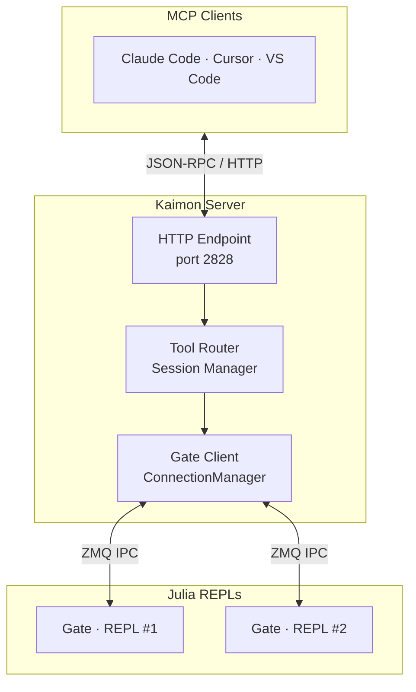
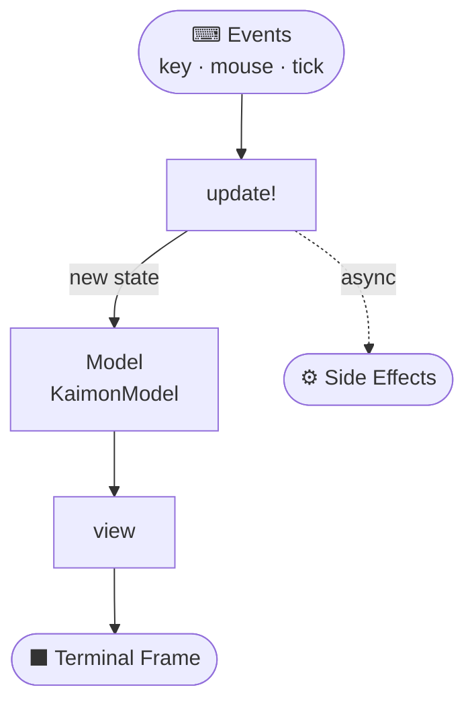

# Architecture

Kaimon exposes Julia REPLs as MCP (Model Context Protocol) servers for AI
agents. This document describes the system architecture, communication
protocols, and key modules.

## System Overview



MCP clients communicate with the Kaimon server over HTTP. The server routes
tool calls either to its own process (standalone mode) or through ZMQ IPC
sockets to external Julia REPLs (TUI/gate mode).

## MCP Protocol Layer

Kaimon implements the [MCP Streamable HTTP transport](https://modelcontextprotocol.io/specification/2025-03-26/basic/transports#streamable-http).
All communication uses JSON-RPC 2.0 over HTTP POST.

### Endpoints

| Path | Method | Description |
|------|--------|-------------|
| `/` or `/mcp` | POST | JSON-RPC requests (tool calls, initialize, etc.) |
| `/vscode-response` | POST | Bidirectional VS Code command responses |
| `/.well-known/agents.md` | GET | Project AGENTS.md file |

### Request Lifecycle

1. Client sends a JSON-RPC POST with `Mcp-Session-Id` header.
2. Server resolves or creates an `MCPSession` from the header.
3. For `tools/call` requests, the server looks up the tool by name and
   dispatches to its handler.
4. In gate mode, long-running tool calls (like `ex`) use SSE streaming:
   the response is `Content-Type: text/event-stream` with
   `notifications/progress` events followed by the final JSON-RPC result.
5. Non-streaming responses return `Content-Type: application/json`.

### Session Management

Each MCP client connection is tracked as an `MCPSession` with states:

- **UNINITIALIZED** -- Session created, awaiting `initialize` request.
- **INITIALIZED** -- Protocol version negotiated, ready for tool calls.
- **CLOSED** -- Session terminated.

Sessions are persisted to `~/.cache/kaimon/sessions.json` so clients can
reconnect after a server restart without re-initializing.

## Kaimon Server

The server (`src/MCPServer.jl`) is an HTTP.jl server that handles:

- **Tool routing** -- Maintains a `Dict{Symbol, MCPTool}` registry mapping
  tool IDs to handlers. Tools are defined with the `@mcp_tool` macro or
  assembled by `collect_tools()`.
- **Session management** -- Per-request session lookup via the
  `Mcp-Session-Id` header, with automatic creation for clients that skip
  initialization.
- **Security enforcement** -- Every request passes through API key and IP
  validation before reaching the handler.
- **SSE streaming** -- For gate-mode tool calls that may run for seconds or
  minutes, the server streams progress notifications as SSE events with a
  5-second heartbeat to prevent connection timeouts.
- **Dynamic tool registration** -- Tools can be registered and unregistered at
  runtime (e.g., when a gate session connects with custom tools). The server
  sends `notifications/tools/list_changed` so clients refresh their tool list.

### Standalone vs. TUI Mode

| | Standalone (`start!()`) | TUI (`tui()`) |
|---|---|---|
| Process model | Server + REPL in one process | Server in TUI process, REPLs connect via Gate |
| Code execution | Direct `Core.eval(Main, expr)` | Forwarded over ZMQ to external REPL |
| Default port | From config (dynamic) | 2828 |
| Dashboard | None (REPL prompt indicator) | Full terminal UI |
| Multi-session | Single REPL | Multiple REPLs via Gate |

## The Gate Module

The Gate (`src/gate.jl`) is the bridge between the Kaimon server and
external Julia processes.

### Gate Server (REPL side)

`Gate.serve()` runs inside the user's Julia REPL. It:

1. Binds a ZMQ REP socket at `~/.cache/kaimon/sock/<session-id>.sock`.
2. Opens a ZMQ PUB socket for streaming stdout/stderr during eval.
3. Enters a message loop that handles requests:
   - `:eval` / `:eval_async` -- Evaluate Julia code, capturing stdout, stderr,
     return value, and exceptions.
   - `:ping` -- Health check returning session metadata, Revise status,
     project path, Julia version, PID, and registered tool metadata.
   - `:restart` -- Restart the Julia process via `execvp`, preserving the
     session ID so the TUI reconnects automatically.
   - `:tool_call` -- Dispatch to a session-scoped `GateTool` handler.

### Gate Client (TUI side)

The `ConnectionManager` (`src/gate_client.jl`) runs inside the Kaimon TUI
process. It:

1. Watches `~/.cache/kaimon/sock/` for new `.sock` files.
2. Connects a ZMQ REQ socket to each discovered gate.
3. Maintains `REPLConnection` objects with health status, project metadata,
   and tool call counts.
4. Provides `eval_remote()` and `eval_remote_async()` for sending code to
   specific sessions.

### Session-Scoped Tools (GateTool)

Gate sessions can register custom tools:

```julia
Gate.serve(tools=[Gate.GateTool("my_tool", my_handler)])
```

The Gate reflects on the handler function's type signature using Julia's
reflection APIs (`methods`, `fieldnames`, `fieldtypes`) to generate MCP
JSON Schema automatically. This includes support for:

- Primitive types (String, Int, Float64, Bool)
- Enums (mapped to JSON Schema `enum`)
- Structs (mapped to JSON Schema `object` with typed fields)
- `Union{T, Nothing}` (marks the parameter as optional)
- Vectors (mapped to JSON Schema `array` with element type)

When a gate session connects, the TUI registers its tools into the MCP
server's tool registry and sends `notifications/tools/list_changed`.

## TUI Architecture

The terminal dashboard (`src/tui.jl` and `src/tui/`) is built on
[Tachikoma.jl](https://github.com/kburke/Tachikoma.jl), a Julia TUI
framework. It follows the Elm architecture:



- **Model** (`KaimonModel` in `src/tui/types.jl`) -- All application state:
  connection manager, server status, activity log, in-flight tool calls,
  search index state, configuration flow state.
- **update!** (`src/tui/update.jl`) -- Handles keyboard events, tick events
  (polling gate health, processing reindex queues), and background task
  results.
- **view** (`src/tui/view.jl`) -- Renders the model into Tachikoma widgets
  (Block, TabBar, Table, SelectableList, StatusBar, Modal, etc.) that
  produce a terminal frame at 30 fps.

The TUI has several tabs:

- **Sessions** -- Connected REPL gates with status and metadata.
- **Activity** -- Live tool call feed with in-flight progress tracking.
- **Server** -- MCP server logs and configuration.
- **Search** -- Qdrant vector search index management.
- **Config** -- Security and client configuration.
- **Advanced** -- Debug and diagnostics.

### Hot Reload

The TUI supports Revise.jl hot reloading via `Ctrl-U`. The app loop exits,
calls `Revise.revise()`, and re-enters `app()` with `Base.invokelatest` so
updated `view()` and `update!()` methods take effect without restarting.

## Security Layer

Security is configured in `~/.config/kaimon/security.json` (global) or
`.kaimon/security.json` (per-project). The configuration defines:

### Three Security Modes

| Mode | API Key Required | IP Allowlist Enforced | Use Case |
|------|------------------|-----------------------|----------|
| `strict` | Yes | Yes | Production, shared machines |
| `relaxed` | Yes | No | Local development with auth |
| `lax` | No | No | Trusted local-only setups |

### Authentication Flow

1. Extract `Authorization: Bearer <key>` from the request header.
2. Validate the key against the configured `api_keys` list.
3. In `strict` mode, also validate the client IP against `allowed_ips`
   (defaults to `127.0.0.1` and `::1`).
4. For VS Code bidirectional communication, single-use cryptographic nonces
   replace API keys to prevent replay attacks.

### API Key Format

Keys follow the pattern `kaimon_<40 hex chars>` (160-bit entropy). They are
generated by `Kaimon.generate_key()` or during the setup wizard.

## Key File Locations

| Path | Purpose |
|------|---------|
| `~/.config/kaimon/security.json` | Global security configuration |
| `.kaimon/security.json` | Per-project security override |
| `.kaimon/tools.json` | Per-project tool enable/disable config |
| `~/.cache/kaimon/sock/` | ZMQ IPC socket files for gate connections |
| `~/.cache/kaimon/sessions.json` | Persisted MCP session state |
| `~/.cache/kaimon/` | Logs, database, and other operational files |
