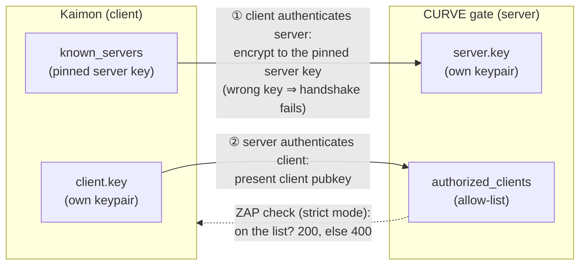
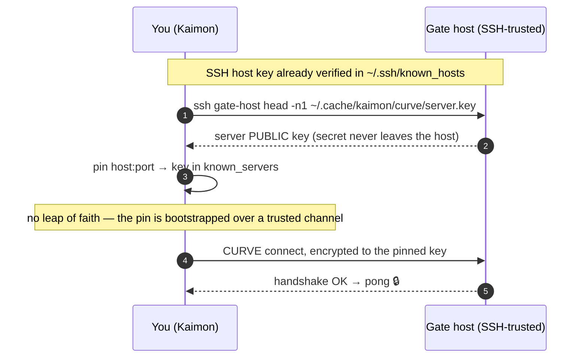

# Encrypted Transport (CURVE)

A TCP [gate](gate.md#tcp-mode) is, by default, an unencrypted remote
code-execution endpoint protected only by a bearer [token](security.md#gate-tcp-authentication)
that travels in the clear. To expose a gate beyond `localhost` safely, enable
**CURVE** — ZMQ's Curve25519 transport (encryption via libsodium) — for
**confidentiality, integrity, and mutual authentication** on the wire.

CURVE makes an SSH tunnel unnecessary *for security*. You may still want SSH (or a
VPN) for *reachability* — NAT, firewalls — in which case CURVE simply runs inside
it, and the two are complementary rather than redundant.

Turn it on when starting the gate (see [CURVE Encryption](gate.md#curve-encryption)
for the full set of flags / env vars / `kaimon.toml` keys):

```julia
KaimonGate.serve(mode=:tcp, port=10005, curve=true)                  # strict allow-list
KaimonGate.serve(mode=:tcp, port=10005, curve=true, allow_any=true)  # pin-only
```

## Two directions of trust

Like SSH, CURVE authenticates **both** ends, via two independent mechanisms:



1. **The client authenticates the server** with a *pinned* public key. CURVE has no
   in-band key exchange, so the client must already hold the server's public key
   *before* connecting; a server presenting a different key simply fails the
   handshake (MITM-safe). How that pin is established — and its one weak spot — is
   covered in [TOFU and soy-free mode](#tofu-and-soy-free-mode).
2. **The server authenticates the client** with an allow-list, via the ZMQ **ZAP**
   mechanism. Two postures, set by `allow_any`:
   - **`allow_any=true`** (pin-only) — encryption + server pinning; any client that
     holds the server key may connect.
   - **`allow_any=false`** (default, strict) — each connecting client's public key
     must be on the allow-list; an empty list is **fail-closed** (nobody). This is
     full mutual authentication.

   The allow-list is re-read from disk on **every handshake**, so
   `authorize_client!` / `revoke_client!` take effect **without restarting the
   gate**. (ZAP only gates *new* handshakes — an already-connected client stays
   connected until it reconnects.)

## Keys live per user

All CURVE material is stored under your cache directory, mode `0600`:

| File | Role |
|---|---|
| `~/.cache/kaimon/curve/server.key` | this host's server keypair (gates present it) |
| `~/.cache/kaimon/curve/client.key` | this Kaimon's client keypair (used to connect out) |
| `~/.cache/kaimon/curve/known_servers` | pinned server keys — `host:port pubkey` lines (TOFU) |
| `~/.cache/kaimon/curve/authorized_clients` | allow-listed client public keys |

Because the keystore is rooted in each user's private home, two users on one
machine get **independent trust domains** for free: under strict mode, a client
authorized by one user cannot connect to the other's CURVE gates.

## TOFU and soy-free mode

First contact is the one weak point. Under **TOFU** (Trust On First Use — a.k.a.
the "leap of faith" model, the same scheme SSH uses for host keys) the client pins
whatever server key it sees on the first successful connection and verifies it
never changes thereafter. That closes every *later* MITM, but an attacker present
at the *very first* connection could get their key pinned.

**Soy-free mode** removes even that gap. If you already have SSH access to the gate
host, fetch the server's public key over that *already-authenticated* channel and
pin it *before* the first ZMQ connection:

```julia
KaimonGate.verify_server_key_via_ssh("gate-host", 10005)
```



`verify_server_key_via_ssh` reads only the **first line** of the remote
`server.key` (the public half — the secret never crosses the wire) and reconciles
it with your local pin:

| Result | Meaning |
|---|---|
| `:pinned` | no prior pin — bootstrapped from the SSH-fetched key (no leap of faith) |
| `:ok` | the SSH-fetched key matches your existing pin |
| `:changed` | the host's key **differs** from your pin — a rotation, or an attack |
| `:error` | SSH/read failure — the pin is left untouched |

It's called *soy-free* because it's the antidote to TOFU: you don't take the
mystery dish on faith — you bring your own verified key (the steak, not the tofu).
And because the CURVE server key is *server-authenticating* (the client must
encrypt to it; there is no bearer secret to capture), bootstrapping the pin over
SSH collapses trust down to "do you already trust SSH to this host?" — which you
do, since you SSH there anyway.

!!! tip "Defaults assume the standard identity"
    `verify_server_key_via_ssh` reads `~/.cache/kaimon/curve/server.key` and SSHes
    to `host` by default. A gate started with an explicit `server_secret` (not the
    shared host key), or reachable under a different SSH alias, needs the
    `remote_key_path` / `ssh_target` keyword arguments.

## Managing keys in the TUI

The Sessions tab has a CURVE key-management modal — press **`k`**:


- **Identity** — this instance's client and server key fingerprints. The full
  selected key is shown so you can hand it to a remote gate operator for enrollment.
- **Authorized clients** — `a` to add a client key, `d` to revoke. Changes apply
  live (no gate restart).
- **Pinned servers** — `u` to unpin, **`s` for soy-free verify** (SSH-checks the
  selected pin). A changed key raises a loud **"SERVER KEY CHANGED"** alert and
  asks for confirmation before re-pinning.

Encrypted sessions show a 🔒 in the Sessions list and on the Details pane.

## Diagnosing a stalled CURVE session

A wrong or missing key fails the handshake *silently* — in-band it is
indistinguishable from the gate being down. So when a TCP session stalls, Kaimon
runs a raw TCP-reachability probe and labels *why* on the Sessions detail line:

| Reason | Meaning | Fix |
|---|---|---|
| `offline` | the port refused the connection | the gate is down / not listening |
| `key?` | reachable, but the pinned-key handshake fails | the server key likely changed — soy-free verify, then re-pin |
| `no pong` | reachable, no key pinned, no response | if it is a CURVE gate, pin/verify its key |

## API

| Function | Purpose |
|---|---|
| `KaimonGate.verify_server_key_via_ssh(host, port; ssh_target, remote_key_path, repin)` | soy-free: SSH-bootstrap / verify a server pin |
| `KaimonGate.pin_server!(host, port, pubkey)` | pin a server key (`:pinned` / `:ok` / `:mismatch`) |
| `KaimonGate.unpin_server!("host:port")` | remove a server pin |
| `KaimonGate.known_servers()` | list all pins as `(host:port, pubkey)` |
| `KaimonGate.authorize_client!(pubkey)` | add a client to the allow-list (live) |
| `KaimonGate.revoke_client!(pubkey)` | remove a client from the allow-list (live) |
| `KaimonGate.authorized_clients()` | list allow-listed client keys |
| `KaimonGate.curve_keypair()` / `curve_public(secret)` | generate / derive Z85 keys |
