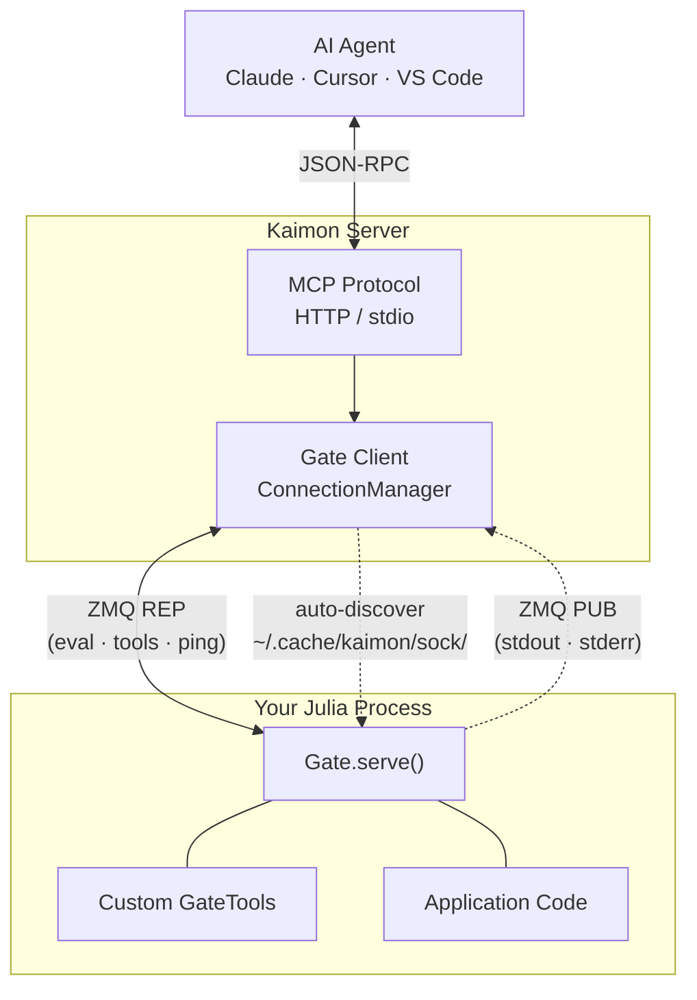

# The Gate

The Gate is Kaimon's bridge between external Julia processes and the MCP server. It lets any Julia REPL -- your application, a data pipeline, a TUI -- expose itself as a live session that AI agents can interact with, complete with custom tools.

## Architecture

The Gate uses ZMQ (ZeroMQ) IPC sockets for communication:



- A **REP socket** handles request-reply messages: eval, tool calls, pings, restarts, option changes.
- A **PUB socket** streams stdout/stderr in real-time so the agent and TUI see output as it happens.
- **Session discovery** works via JSON metadata files written to `~/.cache/kaimon/sock/`. The Kaimon server watches this directory and automatically connects to new sessions.

## GateTool

`GateTool` is the struct that wraps a Julia function for exposure as an MCP tool. Kaimon reflects on the function's signature to auto-generate the MCP schema -- argument names, types, required/optional status, and docstrings are all extracted automatically.

```julia
struct GateTool
    name::String
    handler::Function
end
```

The `name` field becomes the MCP tool name (potentially prefixed by the session namespace). The `handler` is any Julia function whose signature will be introspected.

## Gate.serve()

Start the gate from any Julia REPL:

```julia
using Kaimon
Gate.serve()
```

This is non-blocking. The gate runs in a background task and returns immediately. Kaimon's server discovers the session automatically.

### Full signature

```julia
Gate.serve(;
    session_id::Union{String,Nothing} = nothing,
    force::Bool = false,
    tools::Vector{GateTool} = GateTool[],
    namespace::String = "",
    allow_mirror::Bool = true,
    allow_restart::Bool = true,
)
```

| Parameter | Description |
|-----------|-------------|
| `session_id` | Reuse a session ID (e.g., after an exec restart). Auto-generated if `nothing`. |
| `force` | Skip the TTY check. Required for non-interactive processes that want a gate. |
| `tools` | Session-scoped tools to expose via MCP. |
| `namespace` | Stable prefix for tool names. Auto-derived from project basename if empty. |
| `allow_mirror` | Whether the agent can enable host REPL mirroring. Default `true`. |
| `allow_restart` | Whether the agent can trigger a remote restart via `manage_repl`. Default `true`. |

## Building Custom Tools

Define a plain Julia function with typed arguments, then wrap it in a `GateTool`:

```julia
using Kaimon.Gate: GateTool, serve

function greet(name::String, excited::Bool=false)
    msg = "Hello, $name!"
    excited ? uppercase(msg) : msg
end

serve(tools=[GateTool("greet", greet)])
```

When the agent calls the `greet` tool, Kaimon will:

1. **Reflect** on `greet`'s method signature to discover that `name` is a required `String` and `excited` is an optional `Bool`.
2. **Generate an MCP schema** with the correct JSON types, required fields, and descriptions (pulled from the function's docstring if present).
3. **Coerce** the incoming JSON arguments to the correct Julia types before calling the function.

### Type introspection details

Kaimon's `_type_to_meta` handles the full type mapping:

| Julia Type | MCP Schema Kind |
|------------|----------------|
| `String` | `"string"` |
| `Bool` | `"boolean"` |
| `Integer` subtypes | `"integer"` |
| `AbstractFloat` subtypes | `"number"` |
| `Symbol` | `"string"` (coerced from string) |
| `@enum` types | `"enum"` with values |
| Structs | `"struct"` with recursive field schemas |
| `AbstractVector` | `"array"` with element type |
| `Union{T, Nothing}` | Schema for `T`, marked as optional |
| `Any` | `"any"` (pass-through) |

### Structs as parameters

Custom structs are automatically decomposed into nested object schemas:

```julia
@enum Priority low medium high critical

struct Tag
    name::String
    color::Symbol
end

struct Task
    title::String
    description::String
    priority::Priority
    tags::Vector{Tag}
end

function add_task(task::Task)
    # Kaimon will construct Task from the incoming JSON Dict,
    # including nested Tag structs and the Priority enum.
    push!(task_list, task)
    "Added: $(task.title)"
end

serve(tools=[GateTool("add_task", add_task)])
```

The agent sees an MCP tool with a nested object schema for `Task`, enum values for `Priority`, and a `Tag` array -- all generated from the Julia types.

### Keyword arguments

Keyword arguments are discovered via `Base.kwarg_decl` and exposed as optional parameters:

```julia
function search(query::String; limit::Int=10, case_sensitive::Bool=false)
    # ...
end

serve(tools=[GateTool("search", search)])
# Agent sees: query (required), limit (optional), case_sensitive (optional)
```

### Dict handler escape hatch

If your handler accepts `Dict{String,Any}`, Kaimon passes the raw arguments directly without reflection:

```julia
function raw_handler(args::Dict{String,Any})
    name = get(args, "name", "world")
    "Hello, $name!"
end
```

## Namespaces

When multiple Julia processes serve tools with the same name, namespaces prevent conflicts. The namespace is auto-derived from the project's directory name, or you can set it explicitly:

```julia
# Two instances of the same app, differentiated by namespace
serve(tools=my_tools, namespace="todo_dev")    # branch A
serve(tools=my_tools, namespace="todo_main")   # branch B
```

Tool names appear in MCP as `namespace_toolname` (e.g., `todo_dev_add_task`). The agent sees and calls them by their namespaced names.

## Mirror Mode

When mirroring is enabled, the agent's code and output are echoed in the host Julia REPL:

```
agent> x = rand(3)
3-element Vector{Float64}:
 0.123
 0.456
 0.789
```

This is controlled by two settings:

- **`allow_mirror`**: Set at `serve()` time. If `false`, the agent cannot enable mirroring. Default `true`.
- **Mirror toggle**: The agent can enable/disable mirroring at runtime via the `set_option` message (`mirror_repl = true/false`), but only if `allow_mirror` is `true`.

The initial mirror state is read from the user's Preferences configuration.

## allow_restart

By default, the agent can restart a session via `manage_repl(command="restart")`. This performs an `execvp` -- the process image is replaced with a fresh Julia, same PID, same terminal, fresh state. The session key is preserved so the agent reconnects seamlessly.

Set `allow_restart=false` to disable this:

```julia
serve(tools=my_tools, allow_restart=false)
```

The agent will see a warning message and must restart the process manually (or rely on Revise for hot-reloading).

## Complete Example

A minimal application with custom tools:

```julia
# my_app.jl
module MyApp

using Kaimon.Gate: GateTool, serve

# Domain types
@enum Status pending running done

struct Job
    id::Int
    name::String
    status::Status
end

# In-memory state
const JOBS = Job[]

# Tool handlers
"""Create a new job with the given name."""
function create_job(name::String)
    id = length(JOBS) + 1
    job = Job(id, name, pending)
    push!(JOBS, job)
    "Created job #$id: $name"
end

"""List all jobs, optionally filtered by status."""
function list_jobs(status::Union{Status, Nothing}=nothing)
    filtered = status === nothing ? JOBS : filter(j -> j.status == status, JOBS)
    join(["#$(j.id) $(j.name) [$(j.status)]" for j in filtered], "\n")
end

function run()
    serve(
        tools=[
            GateTool("create_job", create_job),
            GateTool("list_jobs", list_jobs),
        ],
        namespace="myapp",
        force=true,
    )
end

end # module

MyApp.run()
```

Run it with `julia --project my_app.jl`. The agent will see `myapp_create_job` and `myapp_list_jobs` as available tools, with schemas generated from the function signatures and docstrings.
